# منصة صدى (Sada Platform) 🎙️🤟

**صدى** هي منصة متكاملة وذكية تُعنى بتمكين فئة البكم وضعاف السمع وتسهيل اندماجهم في المجتمع من خلال حلول تقنية تعتمد على لغة الإشارة والذكاء الاصطناعي.

---

## 🌟 الميزات الرئيسية

* 🤟 **قاموس لغة الإشارة:** قاموس تفاعلي يضم المصطلحات والإشارات الأساسية لتسهيل التعلم والتواصل.
* 🤖 **المساعد الذكي (AI Assistant):** مساعد صوتي وكتبي يعتمد على الذكاء الاصطناعي لفهم احتياجات المستخدم وتسريع المحادثات.
* 🔊 **تحويل النص إلى كلام (TTS):** تحويل النصوص المكتوبة إلى صوت مسموع فوراً لتمكين المستخدم من التعبير عن نفسه.
* 🖼️ **تحليل الصور:** دعم تقنيات التعرف على الصور وإدراك المحتوى للمساعدة في المواقف اليومية.

---

## 🛠️ البنية التقنية (Tech Stack)

* **تطبيق الجوال:** Flutter & Dart
* **الخلفية والبرمجيات:** ASP.NET Core API

  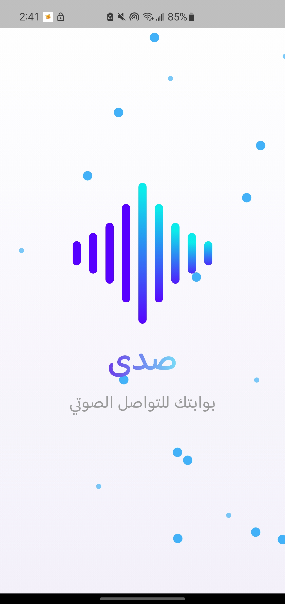
  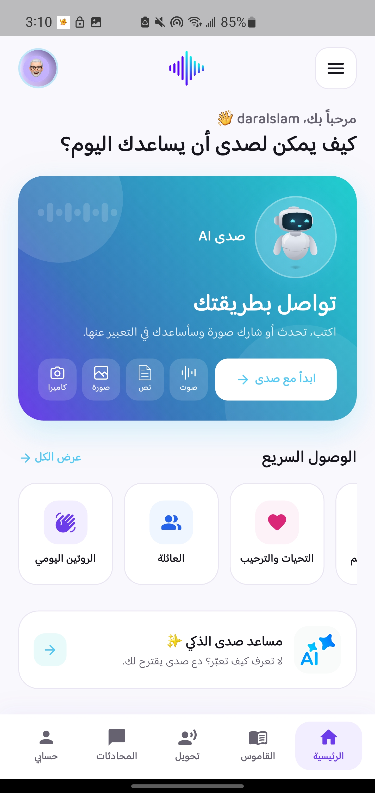
  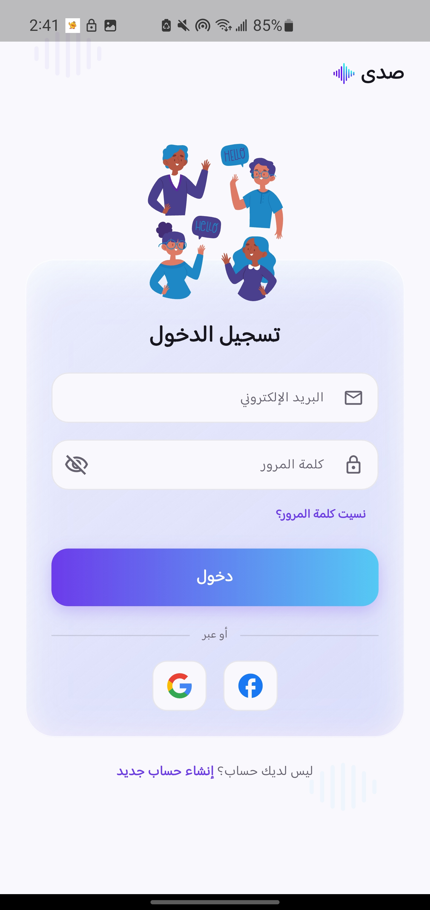
  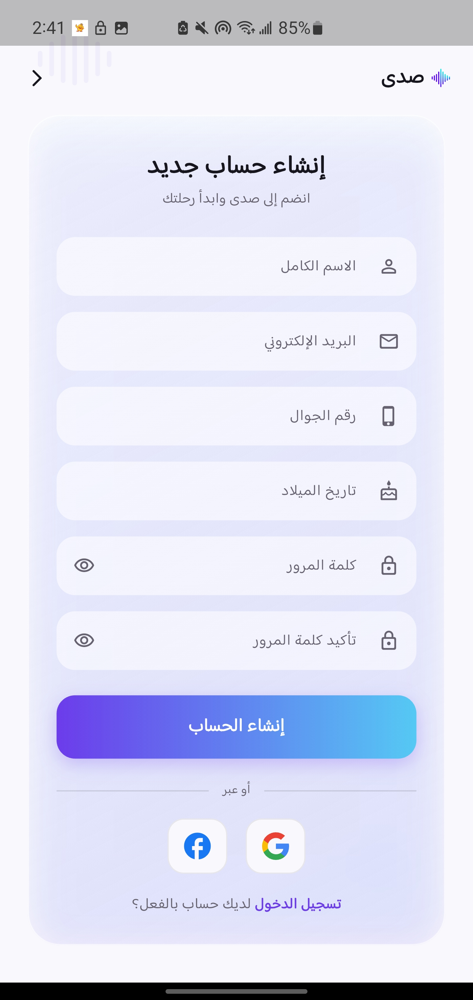
  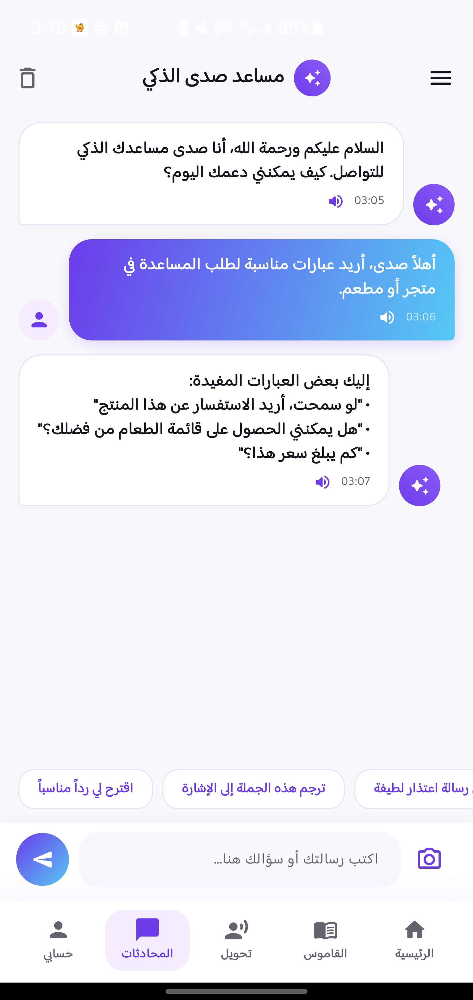
  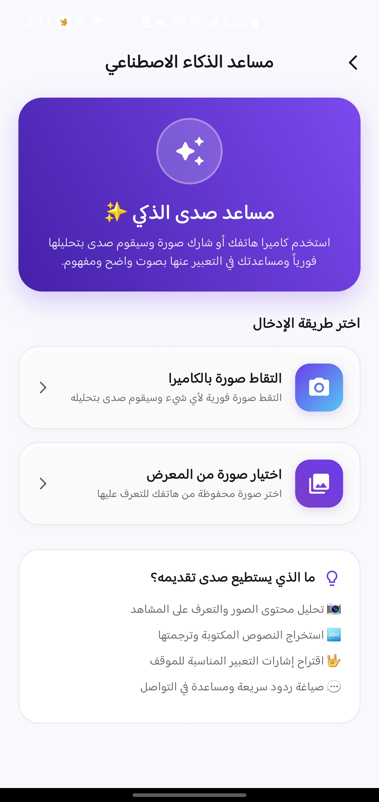
  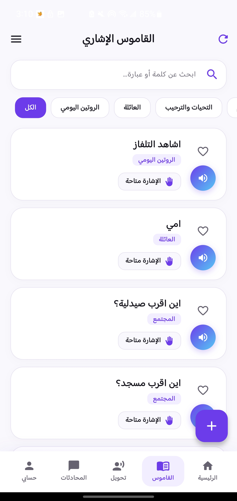
  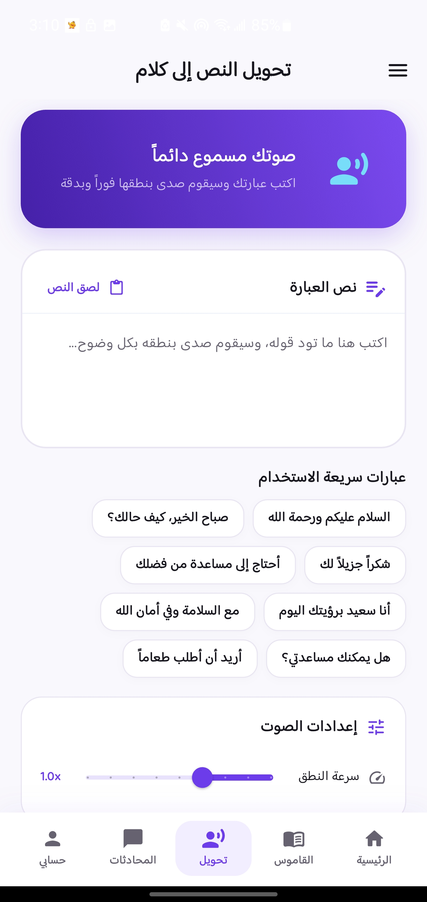
  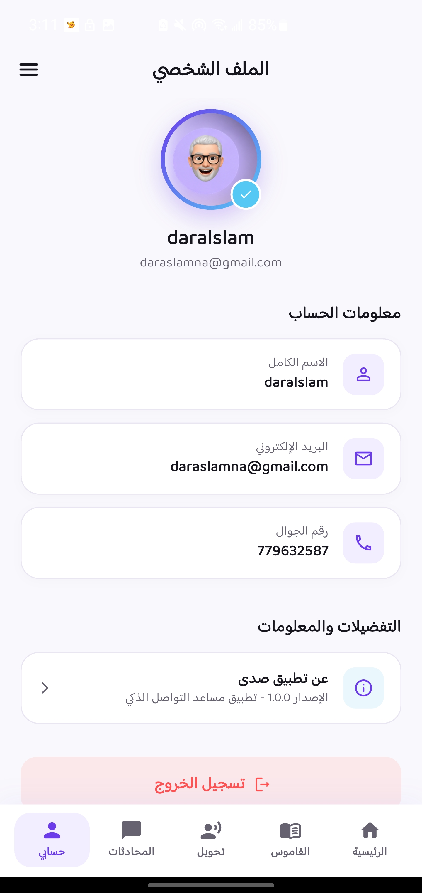
  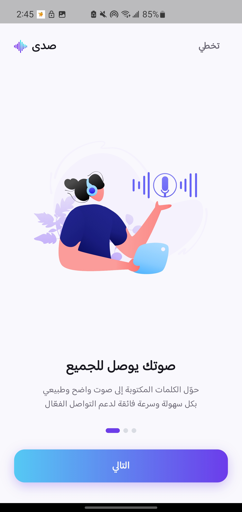
  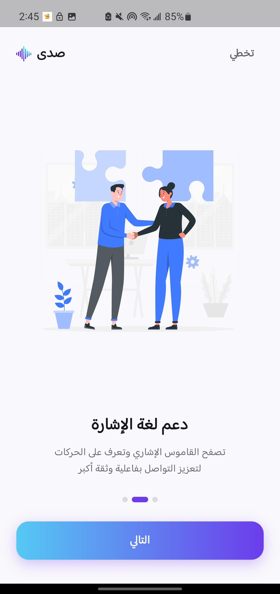
  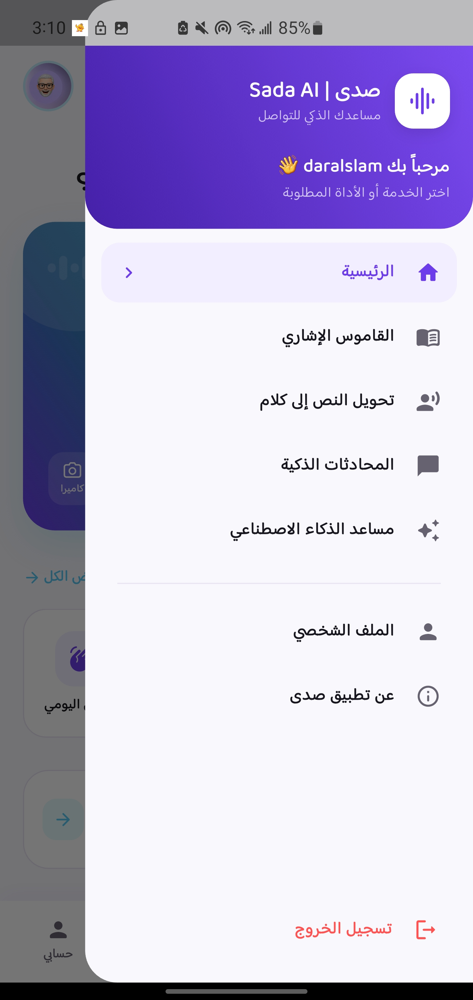

